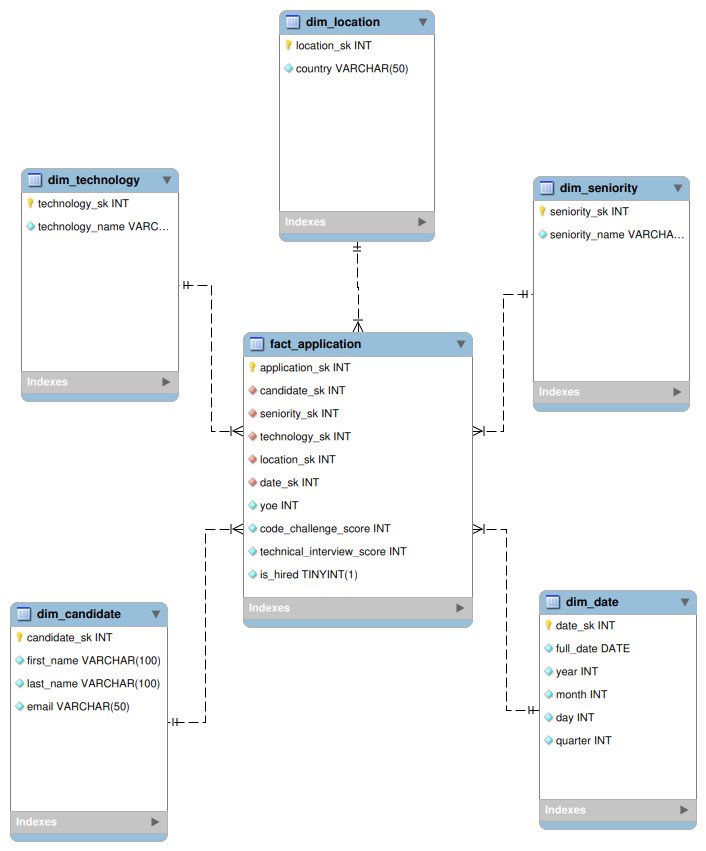
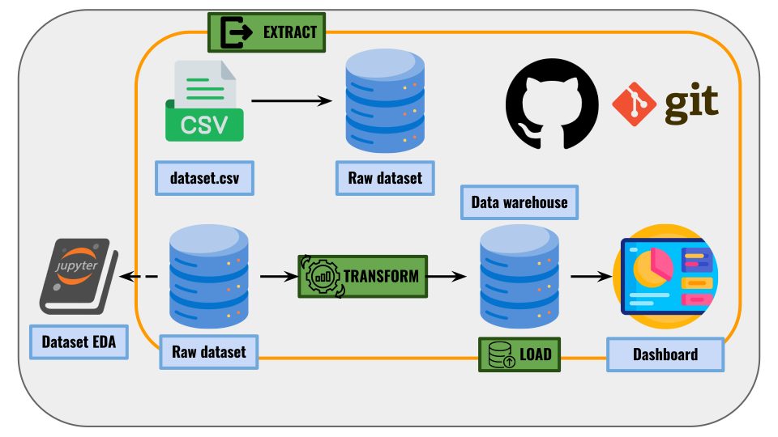
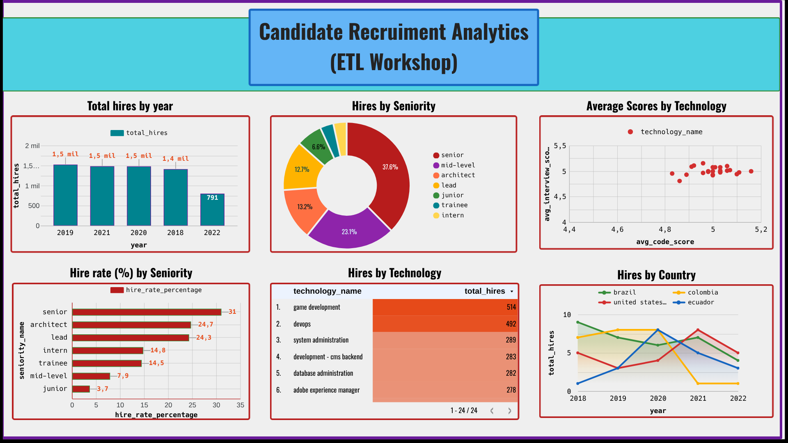

# Candidate Recruitment Analytics - ETL Workshop

## 📌 Project Objective
This project is a complete **Data Engineering** pipeline simulating a real-world technical challenge. The objective is to design and implement an end-to-end ETL (Extract, Transform, Load) process that ingests 50,000 raw candidate application records, applies business rules and data quality fixes, and loads them into a Dimensional Data Model (**Star Schema**) hosted on MySQL. Finally, the Data Warehouse is used to serve analytical queries and a BI Dashboard to derive actionable HR KPIs.

---

## 🏛️ Dimensional Data Model (Star Schema)

The database was modeled using a classic Star Schema approach to optimize analytical queries. 

### Grain Definition
**"One row per candidate application."**
The atomic level of the fact table represents a single moment in time when a candidate applied for a specific role. To support this grain efficiently and handle potential multiple applications from the same candidate on the same day, a dedicated surrogate key (`application_sk`) was implemented in the Fact Table.

### Star Schema Design Decisions
*   **Fact Table (`fact_application`):** Contains the measurable facts (`yoe`, `code_challenge_score`, `technical_interview_score`) and a derived business fact (`is_hired`). It connects to all dimensions via non-identifying relationships.
*   **Dimensions:**
    *   `dim_candidate`: Stores candidate identity. The natural key (`email`) has a `UNIQUE` constraint to prevent logical duplicates.
    *   `dim_location`: Normalizes the 244 geographical entities found in the source.
    *   `dim_technology`: Catalog of applied roles.
    *   `dim_seniority`: Normalized experience levels.
    *   `dim_date`: Extracted from the application date, split into `year`, `month`, `day`, and `quarter` to avoid complex temporal SQL functions during BI reporting.
*   **Surrogate Keys (SKs):** Every dimension utilizes an auto-incremental integer as its Primary Key (e.g., `candidate_sk`, `technology_sk`). Natural keys from the CSV were strictly avoided as PKs following Data Warehousing best practices.



---

## ⚙️ ETL Logic

The pipeline is entirely built in Python (Pandas + SQLAlchemy) and orchestrated via `src/main.py`. following the architecture diagram below:



### 1. Extract (`src/extract.py`)
*   Dynamically locates the `data/raw/candidates.csv` file using `pathlib` for cross-OS compatibility.
*   Reads the semi-colon (`;`) delimited file and performs basic structural validation (asserting the expected 10 columns).

### 2. Transform (`src/transform.py`)
*   **Standardization:** All string variables and column headers are normalized to lowercase.
*   **Deduplication:** Fully drops rows sharing the same email (`keep=False`).
*   **Business Rule ("HIRED"):** Creates the `is_hired` boolean flag. A candidate gets a `1` if BOTH `code_challenge_score` and `technical_interview_score` are $\ge 7$.
*   **Anomaly Correction:** Overwrites the original `seniority` column based on a predefined matrix comparing Years of Experience (`yoe`) and `technical_interview_score`.
*   **Date Expansion:** Casts the string date into datetime objects and extracts atomic temporal features.
*   **Extra (export csv cleaned):** Exports the cleaned csv to `data/processed/candidates_cleaned.csv`.

### 3. Load (`src/load.py`)
*   **Dynamic Initialization:** Checks if the MySQL database exists; if not, it automatically runs the schema creation script (`sql/create_tables.sql`).
*   **SCD Type 1 (Anti-Join):** Extracts existing natural keys from the DB and performs an Anti-Join against the current batch to insert **only new dimension records**, avoiding constraint violations.
*   **SK Mapping:** Retrieves the generated Surrogate Keys from the dimensions and merges them into the fact dataframe before the final load.

---

## 🔍 Data Quality Assumptions & Discoveries (EDA)

During the Exploratory Data Analysis (`notebooks/eda.ipynb`), several assumptions were made:
1.  **Email Duplication:** Out of 50,000 rows, 167 emails were duplicated (belonging to entirely different names). Assumption: This represents a severe data capture error or fraud. All records tied to duplicated emails were entirely purged from the pipeline to protect the DW's integrity.
2.  **Geographical Cardinality:** 244 unique countries were detected (exceeding the 195 UN sovereign states). Assumption: The system captures dependent territories according to the ISO 3166 standard. Validated via the `pycountry` library.
3.  **YOE vs Seniority Desync:** Correlation analysis proved that `YOE` and `Seniority` were randomly generated independently (e.g., "Trainees" with 25 YOE). Assumption: `YOE` and technical scores are "harder" facts than a dropdown label. Thus, `Seniority` was programmatically re-inferred based on experience and test scores.

---

## 🚀 How to Run the Project

### Prerequisites
*   Python 3.10+
*   MySQL Server (Running locally or exposed via TCP)
*   Virtual Environment (Recommended)

### Setup Instructions
1. Clone the repository and navigate to the project root.
2. Create and activate a virtual environment:
   ```bash
   python -m venv .venv
   source .venv/bin/activate  # Linux/Mac
   # .venv\Scripts\activate   # Windows
   ```
3. Install dependencies:
   ```bash
   pip install -r requirements.txt
   ```
4. Create a `.env` file in the root directory with your MySQL credentials:
   ```env
   DB_USER=your_user
   DB_PASSWORD=your_password
   DB_HOST=localhost
   DB_PORT=3306
   DB_NAME=candidates_dw
   ```
5. Run the ETL pipeline:
   ```bash
   python src/main.py
   ```
   *(The database and schema will be initialized automatically if they don't exist).*

---

## 📊 Example Outputs & KPIs

Once the Data Warehouse is loaded, the `sql/kpi_queries.sql` script can be executed to generate the following analytical insights:
1.  **Hires by Technology:** Identifies the technical roles with the highest conversion (e.g., Game Development and DevOps).
2.  **Hires by Year:** Tracks the company's recruitment volume over time.
3.  **Hires by Seniority:** Demonstrates the talent distribution (heavy focus on hiring Seniors).
4.  **Hires by Country (Focus):** Compares specific LATAM/US market volumes.
5.  **Hire Rate (%) by Seniority:** A critical conversion metric proving that Senior profiles have a much higher success rate (~31%) compared to Interns (~14%).
6.  **Average Scores by Technology:** Evaluates baseline technical capabilities across different stacks.

*A fully interactive dashboard connected directly to the MySQL Data Warehouse via Ngrok tunnel was built using Looker Studio to visualize these metrics.*


